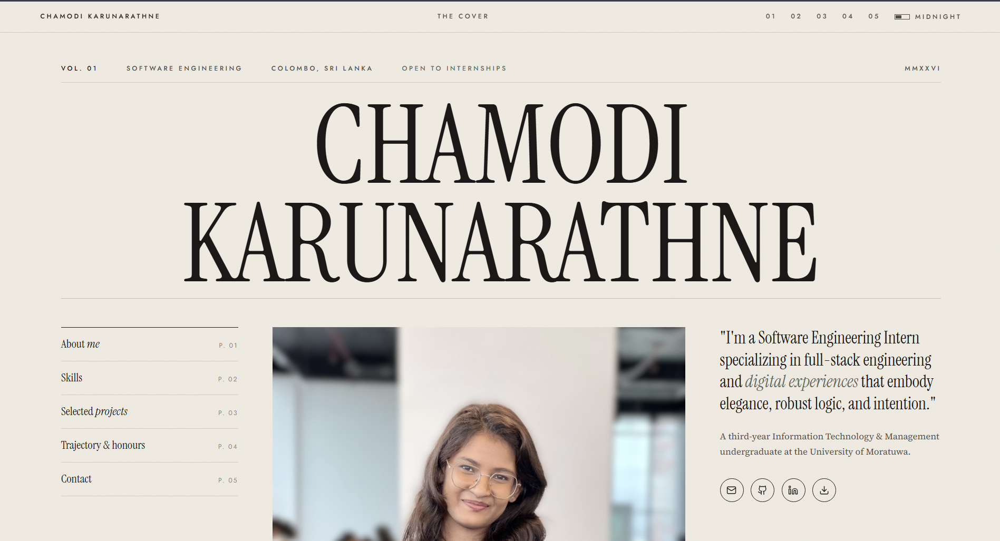

# Chamodi Karunarathne — Personal Portfolio

**[🔗 View the Live Site](https://www.chamodi.dev)**



## Overview

I'm **Chamodi Karunarathne**, a software engineering intern and Information Technology & Management undergraduate at the University of Moratuwa. I built this responsive portfolio to showcase my software and hardware projects, technical skills, professional journey, and honours, with direct ways to get in touch with me and view my CV.

I followed a unique magazine-style UI inspired by vintage print publications. I paired an oversized serif nameplate with warm paper tones, fine dividing lines, a subtle grain texture, and a column-based layout to give the portfolio the feel of a magazine cover. Numbered sections and a contents-style navigation carry that editorial style throughout the site.

## Built With

| Area | Technologies |
| --- | --- |
| Framework | Next.js 16 with the App Router |
| UI | React 19, TypeScript, and semantic HTML |
| Styling | Custom CSS, CSS variables, responsive grids, and media queries; Tailwind CSS 4 is included in the PostCSS tooling |
| Animation | CSS transitions, the browser's Intersection Observer API, and `requestAnimationFrame` |
| Typography | Instrument Serif, Source Serif 4, and Jost via Google Fonts |
| Code quality | ESLint with Next.js rules and TypeScript |

## How I Built It

I bootstrapped the project with `create-next-app` and organized it into reusable React components. In `app/page.tsx`, I assemble the cover, about, skills, projects, experience, and contact sections. I use `app/layout.tsx` for the shared header, metadata, fonts, and visual effects.

I use Server Components for most content and Client Components for theme switching, scroll reveals, the current-section indicator, and entrance effects. I defined the visual system in `app/globals.css`, using shared variables for typography, spacing, colours, and both themes. I keep my images and CV in `public/`.

I created the vintage look with custom CSS and the Instrument Serif, Source Serif 4, and Jost fonts from Google Fonts. CSS transitions and native browser APIs provide the entrance and scroll effects.

## Key Features

- **Responsive layout:** Adapts navigation, typography, and content grids for desktop, tablet, and mobile screens.
- **Light and dark themes:** Light “Edition” mode is the default. Visitors can switch to “Midnight,” and their choice survives refreshes within the same browser tab session using `sessionStorage`.
- **Project showcase:** My selected projects include screenshots, technology tags, roles, timelines, and descriptions.
- **Professional journey:** Dedicated sections for my skills, experience, education, and honours.
- **Scroll interactions:** Content reveals on scroll, an animated nameplate introduces the page, and the header displays the current section.
- **Direct contact:** My email, phone, GitHub, and LinkedIn links make it easy to connect with me.
- **CV access:** Links open my latest CV from [`public/Chamodi_CV.pdf`](public/Chamodi_CV.pdf).
- **Accessibility considerations:** Semantic sections, labelled navigation and controls, a skip-to-content link, image descriptions, and reduced-motion CSS rules.
- **Loading improvements:** Project images use lazy loading, and font connections are preconnected in the document head.

## Project Structure

```text
app/
  components/       # Portfolio sections and interactive components
  globals.css       # Layout, typography, themes, and responsive styles
  layout.tsx        # Shared page shell, metadata, and fonts
  page.tsx          # Homepage composition
public/             # Project images, portrait, and Chamodi_CV.pdf
```

To update the portfolio, edit the relevant section in `app/components/`. Replace images or the CV in `public/`, keeping their filenames aligned with the component links.

## Author & Contact

**Chamodi Karunarathne** · Colombo, Sri Lanka

- **GitHub:** [@Chamodi-Karunarathne](https://github.com/Chamodi-Karunarathne)
- **LinkedIn:** [Chamodi Karunarathne](https://www.linkedin.com/in/chamodikaru)
- **Email:** [chamokarunarathne27@gmail.com](mailto:chamokarunarathne27@gmail.com)
